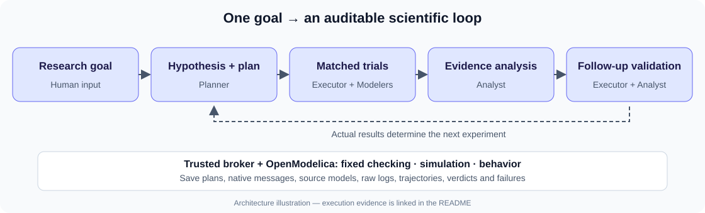

# Pufibara Lab

<h2 align="center"><strong>Live Demo</strong></h2>

  <a href="https://wangzizhe.github.io/Pufibara-Lab/">https://wangzizhe.github.io/Pufibara-Lab</a>

Explore the completed research workflow, Agent handoffs and tool records. **Interactive replay of a real saved run; no live model calls.**

**An automatic research environment that uses Omnigent to investigate how Harness mechanisms affect AI agents building physical models.**

A *Harness* is the context, tools, feedback and execution rules surrounding an agent. Our research question is: **which mechanisms improve modeling success, reduce completion time, or use fewer tokens?** The delivered system runs the research loop; the small Modelica study below demonstrates it with real experiments.

**Review in three steps:** [actual experiment](evidence/sessions/session-789344082fe64fabadcdb06e415d8d0d/session.json) → [native Agent workflow](evidence/omnigent-demo.json) → [claim-to-evidence map](SUBMISSION.md). Saved evidence can be inspected without an LLM connection. Demo videos are supplied separately.

## How the system works

Omnigent delegates to a **Planner**, **Executor**, isolated **Modelers**, and **Analyst**. Agents make research decisions; a trusted broker runs OpenModelica, enforces limits and applies fixed **model checking, simulation and behavior** criteria. Actual delegation and completion messages are saved in the [native parent conversation](evidence/omnigent/e33643e43bc04dba8cd0fd538bbe4dde/e33643e43bc04dba8cd0fd538bbe4dde-items.json). The diagram illustrates architecture; it is not execution evidence.

## Completed study: raw versus structured feedback

**Agent-generated hypothesis:** structured diagnostics improve repair acceptance under the same two-attempt allowance. The Planner compared costed candidates and selected matched raw/structured trials on `cooling-init-v1`, a newly authored Modelica cooling model with an initialization inconsistency. Task, exposed model route, tools, attempt allowance and final evaluation were held matched; seed and temperature were not exposed controls. [Recorded plan and controls](evidence/sessions/session-789344082fe64fabadcdb06e415d8d0d/session.json).

**Evidence-driven adjustment:** the first pair tied. The Analyst selected and executed a fresh matched pair to check whether equal acceptance recurred, rather than claiming an advantage from one result. The reasoning is recorded in `plans[1].repeat_reason` and `selection_reason` in the same session.

| Observed outcome | Raw | Structured |
| --- | ---: | ---: |
| Final accepted trials | 2/2 | 2/2 |
| Development attempts per trial | 2 | 2 |
| Initial-pair tool seconds | 12.208 | 10.258 |
| Follow-up tool seconds | 9.750 | 11.672 |

[Source: actual trial records](evidence/sessions/session-789344082fe64fabadcdb06e415d8d0d/session.json). Twelve deterministic runs comprise four failed baselines, four corrections and four final validations. **No pass-rate or attempt-count advantage was observed, and tool-time ordering reversed.** Two pairs on one task cannot establish general efficacy or equivalence. Tool seconds exclude model and other research overhead.

## Evidence the judges can verify

| Claim | Evidence | Inspect |
| --- | --- | --- |
| Real multi-Agent orchestration | [Native role tree](evidence/omnigent-demo.json) and [parent messages](evidence/omnigent/e33643e43bc04dba8cd0fd538bbe4dde/e33643e43bc04dba8cd0fd538bbe4dde-items.json) | Parent/child IDs, `sys_session_send`, actual tool calls and automatic completion notifications. |
| Hypothesis → experiment → analysis → follow-up | [Completed session](evidence/sessions/session-789344082fe64fabadcdb06e415d8d0d/session.json) | `plans`, `analysis`, trial configurations and final `validated` stage. |
| Actual compiler and simulation execution | [Submitted model](evidence/runs/run-fef27c31a32143f6923faa8836a69dca/submitted.mo), [raw log](evidence/runs/run-fef27c31a32143f6923faa8836a69dca/raw.log), [trajectory](evidence/runs/run-fef27c31a32143f6923faa8836a69dca/cooling_res.csv) | OpenModelica output and numerical data for one final run; source alone is not proof of execution. |
| Fixed acceptance and preserved failures | Four final results below; [attempt IDs](evidence/sessions/session-789344082fe64fabadcdb06e415d8d0d/session.json) | Every attempt resolves to `evidence/runs/<run-id>/`, including failed baselines. Results contain verdicts and provenance hashes. |
| Measured workflow bottleneck | [Measurements](docs/MEASUREMENT.md) and [original comparison](evidence/measurements/workflow-comparison.json) | Actual observations, missing measurements and confounds; no established overall speedup. |

| Final validation | Raw | Structured |
| --- | --- | --- |
| Initial pair | [Result](evidence/runs/run-fef27c31a32143f6923faa8836a69dca/result.json) | [Result](evidence/runs/run-180f007d16724c469a19e5514f6c9662/result.json) |
| Follow-up pair | [Result](evidence/runs/run-948d4dce9e87423ca6a5d7a4d96b5d9a/result.json) | [Result](evidence/runs/run-b1f3eddf85364fcd8e67902f9d133d74/result.json) |

Additional historical runs remain for audit; they are not extra replicates of this study. [Evidence navigation](evidence/README.md) distinguishes primary, engineering and historical records.

## Measured improvement: what remains unproven

The latest native records show **one human goal input and a 766-second goal-to-final-summary span**, with no additional native root control inputs. This retrospective measurement excludes setup and does not capture all human work. [Timestamps, message IDs and source hashes](evidence/measurements/demo-observation.json).

Historical manual/automatic observations were 813.986/2293.816 seconds, with different operators, infrastructure maturity and incomplete action accounting. They cannot establish a matched speedup or be directly compared with the latest run. **Overall speedup, token savings and causal human-work reduction remain unproven.** [Measurement limitations](evidence/measurements/workflow-comparison.json).

## Reproduce and inspect

- [Local installation and checks](docs/LOCAL_SETUP.md); [research execution](docs/RESEARCH_RUN.md). Implementation: `src/`, `scripts/`, `tasks/`, `tests/` and `requirements.lock`. The tested environment uses macOS, Omnigent 0.16.0 and OpenModelica 1.26.1; portability requires further checking.
- Agent specifications: [Coordinator](agents/lab/AGENTS.md), [Planner](agents/lab/agents/planner/AGENTS.md), [Executor](agents/lab/agents/executor/AGENTS.md), [Modeler](agents/lab/agents/executor/agents/modeler/AGENTS.md), [Analyst](agents/lab/agents/analyst/AGENTS.md).
- [Policies and human approval gates](docs/SECURITY.md): restricted tools, budget checks and tested isolation boundaries. A new live run requires its own dedicated login and applicable authorization; archived model configurations disable execution authority. Credentials and local environments are excluded.
- [Public citations and physical assumptions](docs/SOURCES.md); [full submission evidence map](SUBMISSION.md); `PACKAGE_MANIFEST.json` records current file hashes.

## Next experiment and real-world validation

**Proposed, not executed:** compare manual stage triggering with automatic orchestration under matched prepared conditions and completion criteria. Include waits, failures and recovery, record operator work separately, alternate order if repeated, and validate token attribution. [Protocol](docs/MEASUREMENT.md).

Before real-world use, independent physical tasks, broader repetitions, numerical robustness, measured physical data and qualified engineering review remain necessary. The idealized cooling example is not hardware validation. This submission demonstrates an executed scientific loop with a small negative mechanism result; it does not establish a generally faster research system.

Historical non-English text uses labeled editorial views; primary English run evidence is unchanged. See the [English-edition policy](docs/ENGLISH_EDITION.md) and its source hashes before auditing exact historical wording.

## Interactive workflow walkthrough

Explore all six research stages and expandable Agent records in the [Live Demo](https://wangzizhe.github.io/Pufibara-Lab/). An [offline HTML copy](docs/research-walkthrough.html) is also available: choose **Download raw file** and open locally.

Regenerate the page from saved records with `python3 scripts/export_saved_workflow.py`; it makes no model calls. This supporting walkthrough complements the author's separately supplied two-minute demo.
